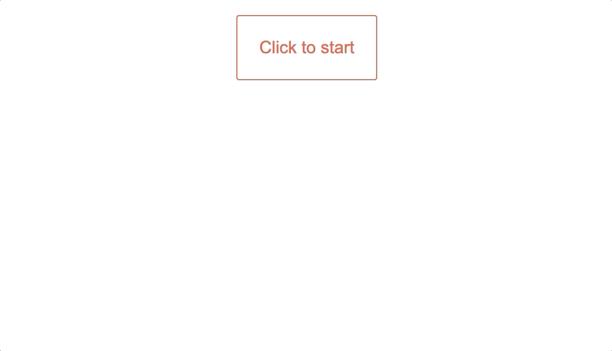

This is a basic framework to open/close a Reveal.js presentation with a simple button.

To begin: 

1. clone this repo 
`git clone https://github.com/jamesjiang13/reveal-slideshow`

2. move into the folder and install dependencies
`cd reveal-slideshow && npm install`

3. build webpack and launch page
`npm run start`
